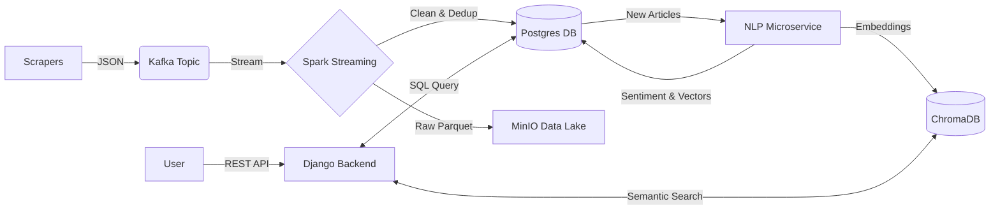

# 📰 News Intelligence Pipeline

**An End-to-End Real-Time News Analysis System**


## 🚀 Overview
The **News Intelligence Pipeline** is a scalable data engineering project that scrapes news from major global sources, processes them in real-time, enriches them with AI (Sentiment Analysis & Embeddings), and exposes the insights via a RAG-enabled API.

It transforms raw unstructured text into **smart, searchable intelligence**.

## 🏗️ Architecture



## 🛠️ Tech Stack
*   **Ingestion**: Python (Selenium/BeautifulSoup) -> Apache Kafka
*   **Processing**: Apache Spark (Structured Streaming)
*   **Storage**: PostgreSQL (Metadata/Enriched) + MinIO (Data Lake)
*   **AI/NLP**:
    *   Sentiment: HuggingFace Transformers (`distilbert`)
    *   Embeddings: SentenceTransformers (`all-MiniLM-L6-v2`)
    *   RAG: ChromaDB (Vector Store)
*   **API**: Django REST Framework (DRF)

## 📂 Project Structure
```bash
news-intelligence-pipeline/
├── api/                  # Django REST API
├── config/               # Configuration (Kafka, Spark)
├── ingestion/            # News Scrapers & Kafka Producers
├── nlp/                  # AI Models (Sentiment, Embeddings)
├── processing/           # Spark Streaming Jobs
├── scripts/              # Utility Scripts (Setup, Verification)
├── storage/              # Database Models & Managers
├── vector_store/         # ChromaDB Client
└── docker-compose.yml    # Infrastructure (Kafka, Zookeeper, Postgres, MinIO)
```

## ⚡ Quick Start

### 1. Prerequisites
*   Docker & Docker Compose
*   Python 3.9+
*   Java 11 (for Spark local dev)

### 2. Setup Infrastructure
Start the core services (Kafka, Postgres, MinIO):
```bash
docker-compose up -d
```

### 3. Install Dependencies
```bash
python -m venv .venv
# Windows: .venv\Scripts\Activate
# Mac/Linux: source .venv/bin/activate

pip install -r requirements.txt
pip install -r requirements_spark.txt
```

### 4. Initialize Database
Create tables in Postgres:
```bash
python scripts/init_storage.py
```

### 5. Run the Pipeline (Simulation)
**A. Start API Server:**
```bash
python api/manage.py runserver
```

**B. Scrape & Ingest Data:**
```bash
python scripts/load_test.py
# Scrapes BBC/CNN -> Sends to Kafka
```

**C. Process Data (Spark):**
```bash
python processing/spark/streaming/spark_streaming_job.py
# Reads Kafka -> Writes to DB & MinIO
```

**D. Enrich Data (AI):**
```bash
python nlp/enrichment_service.py
# Calculates Sentiment & Embeddings -> Updates DB
```

**E. Index Vectors:**
```bash
python scripts/sync_db_to_vector.py
# Syncs Embeddings to ChromaDB
```

## 🔌 API Documentation

### Get News Articles
**Endpoint**: `GET /api/news/`
```json
[
  {
    "id": 1,
    "title": "Global Markets Rally...",
    "source": "Reuters",
    "sentiment_label": "POSITIVE",
    "sentiment_score": 95
  }
]
```

### RAG Chat (Semantic Search)
**Endpoint**: `POST /api/chat/`
**Body**: `{"query": "What is happening in Venezuela?"}`
**Response**:
```json
{
  "answer": "Here are the most relevant news articles:",
  "results": [
    {
      "text": "Venezuela says over 100 political prisoners released...",
      "metadata": { "source": "AlJazeera", "sentiment": "POSITIVE" }
    }
  ]
}
```

## 🔮 Future Roadmap
- [ ] React/Streamlit Frontend Dashboard
- [ ] Kubernetes Deployment (Helm Charts)
- [ ] LLM Integration (DeepSeek/OpenAI) for full answer generation
